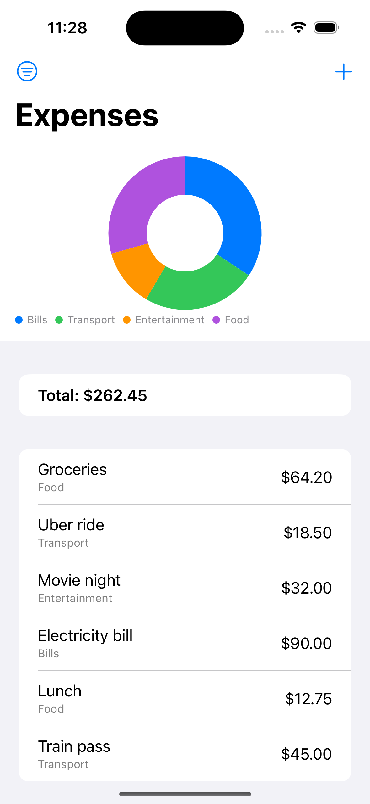
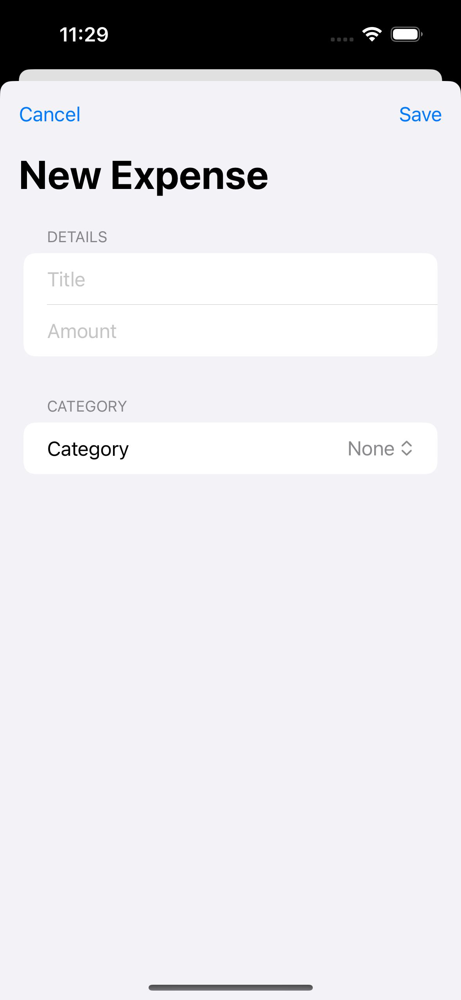

# Expense Tracker

App 4 of 10.

## Goal

Learn SwiftData relationships (a Category has many Expenses), practice building a form with real validation feedback instead of just disabling a save button, and try a second Swift Charts type (a pie/donut chart) after the bar chart in app 3.

## What it does

Log expenses against categories, filter and sort the list, see a category breakdown chart, and validate the add-expense form before saving.

## Screenshots

  
  

## License

MIT, see [LICENSE](LICENSE).

---

Built by [Rishav Jha](https://rishavjha.com)
